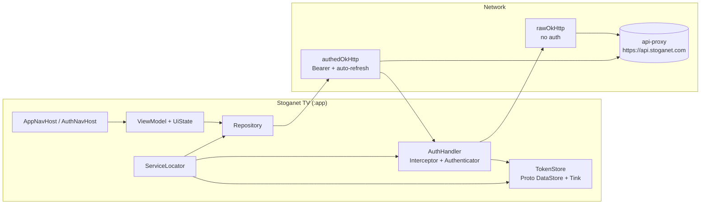

# Stoganet TV

Native Android TV client for the Stoganet ecosystem. Kotlin + Compose-for-TV. Talks exclusively to [api-proxy](https://github.com/Stoganet/api-proxy) — never directly to Jellyfin.

Licensed under [MIT](./LICENSE).

## Architecture at a glance



**Two OkHttp clients, one base URL:**

- `rawOkHttp` — no auth headers. Used by `AuthHandler` for token refresh to avoid infinite 401 loops.
- `authedOkHttp` — attaches `Authorization: Bearer` via `AuthHandler` (OkHttp `Interceptor`) and handles 401 → refresh → retry via `AuthHandler` (OkHttp `Authenticator`).

**Two NavHosts:**

- `AuthNavHost` — shown when no valid tokens exist. Quick Connect screen today.
- `AppNavHost` — shown after authentication. Home screen (placeholder) today.

`MainActivity` decides which NavHost to show based on `TokenStore`.

## Screens

| Screen | Status | NavHost |
|--------|--------|---------|
| Quick Connect | ✅ | Auth |
| Home / Browse | 🔜 | App |
| Catalog detail | 🔜 | App |
| Search | 🔜 | App |

## API client

The Retrofit client is generated from `openapi/openapi.yaml` (a copy of the spec from `api-proxy`). Run `./gradlew :app:openApiGenerate` after updating the spec. Generated code lands in `app/build/generated/openapi/` — never edit by hand.

## Build & run

```bash
./gradlew :app:installDebug                 # build debug and install to connected device/emulator
./gradlew :app:testDebugUnitTest            # unit tests
./gradlew detekt                            # lint
./gradlew detekt --auto-correct             # lint + auto-fix
./gradlew :app:openApiGenerate              # regenerate Retrofit client from openapi/openapi.yaml
./gradlew :app:assembleRelease              # release APK (requires signing config)
```

Run a single test class:

```bash
./gradlew :app:testDebugUnitTest --tests "com.stoganet.tv.ui.auth.QuickConnectViewModelTest"
```

## Repository layout

| Path | What's there |
|------|-------------|
| `openapi/openapi.yaml` | API spec (copy from `api-proxy`) — source of truth for client generation |
| `app/build/generated/openapi/` | Generated Retrofit client and models — do not edit |
| `app/src/main/java/.../data/auth/` | `TokenStore`, `AuthHandler`, `AuthRepository` |
| `app/src/main/java/.../data/net/` | `HttpClients` — OkHttp + Retrofit wiring |
| `app/src/main/java/.../di/` | `ServiceLocator` — manual DI wiring |
| `app/src/main/java/.../ui/` | NavHosts, screens, ViewModels, UiState, Intent types |
| `app/src/main/proto/` | Proto DataStore schema for encrypted token storage |
| `app/src/main/res/` | Strings, drawables, TV banner |

## Environment

No runtime environment variables. `BASE_URL` is hardcoded to `https://api.stoganet.com` in `HttpClients`. Debug builds append `.debug` to `applicationId` and enable HTTP logging (headers only — no body).
